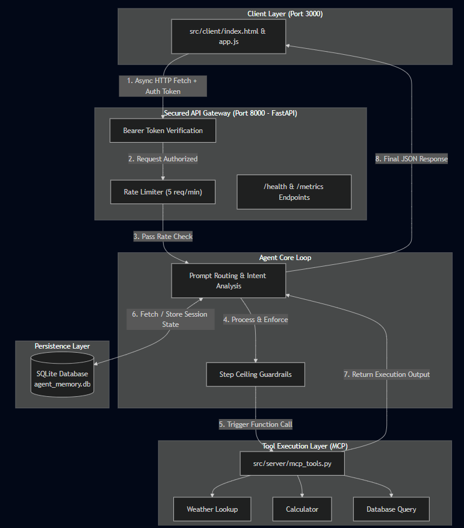
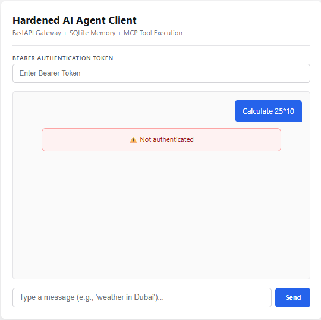
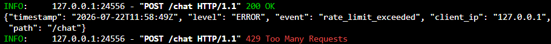
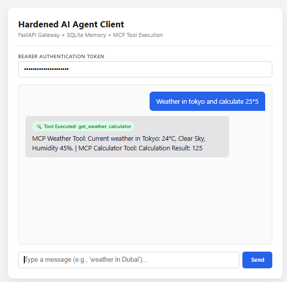
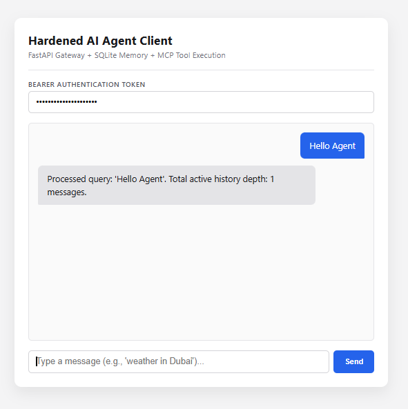
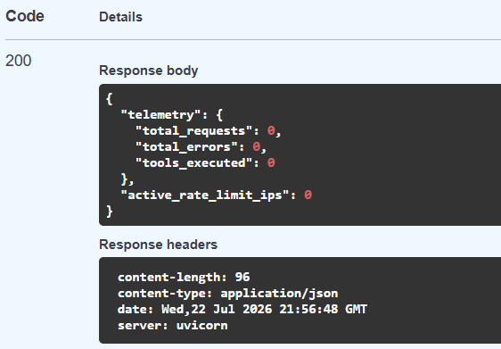
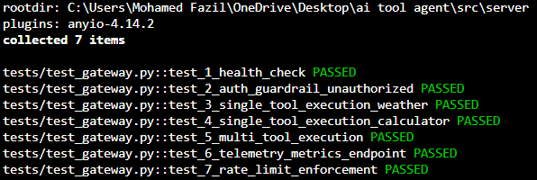

# AI Agent Gateway: Capstone Case Study

An end-to-end, decoupled AI Agent system that bridges a user-facing chat application with specialized execution tools. Built with FastAPI, static web web technologies, and the Model Context Protocol (MCP), this system implements Bearer authentication, rate limiting, persistence, and telemetry observability.

---

## 1. The Pitch

Connecting Large Language Models safely to external execution environments is one of the most critical challenges in AI engineering today. Unprotected LLM endpoints are vulnerable to rate limit abuse, runaway API costs, unauthenticated access, and unpredictable execution paths.

The **AI Agent Gateway** solves this problem by acting as a secure middleware layer. It sits between a lightweight user interface and backend execution tools, ensuring that every user prompt is authenticated, rate-limited, safely routed to the correct tool, and monitored in real time through structured metrics.

---

## 2. System Architecture & Component Breakdown

The project follows a decoupled, split-architecture model where the client interface and backend API run as independent services.

### End-to-End Data Flow

```text
User Request -> Frontend Interface -> API Gateway (Auth & Rate Limit) -> Agent Orchestrator -> MCP Tool Layer -> SQLite Persistence -> User Response

```

### Project Directory Structure

```text
src/
├── client/
│   ├── index.html
│   └── app.js
├── server/
│   ├── tests/
│   │   └── test_gateway.py
│   ├── agent_memory.db
│   ├── database.py
│   ├── main.py
│   └── mcp_tools.py

```

### Architectural Layers

1. **Frontend Interface (`src/client/`)**
* Pure static HTML5 and JavaScript client hosted on Hugging Face Spaces.
* Manages user input, pre-fills access tokens, renders live execution badges when tools run, and communicates with the backend asynchronously using fetch requests.


2. **Secured API Gateway (`src/server/main.py`)**
* Built with FastAPI and hosted on Render.
* Serves as the primary entry point. Enforces Bearer token verification, applies a sliding-window rate limit capped at 5 requests per minute per IP, manages CORS settings, and exposes health and metrics endpoints.


3. **Agent Loop and Intent Router**
* Evaluates incoming user prompts along with past conversation history.
* Dynamically decides whether to answer directly or trigger external execution tools. Enforces maximum step ceilings to prevent infinite execution loops.


4. **MCP Tool Execution Layer (`src/server/mcp_tools.py`)**
* Houses capabilities such as weather lookups and calculators behind standardized Model Context Protocol contracts.
* Isolates tool logic so that third-party failures do not crash the primary server process.


5. **Persistent Memory Layer (`src/server/database.py`)**
* Uses a local SQLite database (`agent_memory.db`) to preserve state across multi-turn sessions.
* Links messages to specific user and conversation IDs so chat context survives server reboots.


6. **Automated Test Suite (`src/server/tests/test_gateway.py`)**
* Built with `pytest` and FastAPI's `TestClient`.
* Executes 7 automated tests to verify authentication, rate limiting, single and multi-tool routing, database interactions, and telemetry logging using mocked model calls.


---

## 3. Engineering Decisions & Trade-Offs

Every technical choice in this project balances functionality, security, and developer overhead:

* **Autonomous Agent Loop vs. Fixed Workflow**
* *Decision*: Built an autonomous loop that selects tools dynamically based on user intent.
* *Why*: Fixed workflows execute rigid sequences regardless of the query. An agent evaluates the input and determines whether to respond immediately or chain tools together.
* *Trade-off*: Increases execution latency slightly because the model must make multiple evaluation passes.


* **Model Context Protocol (MCP) vs. Hardcoded Tools**
* *Decision*: Standardized tools using MCP schemas rather than writing function calls directly inside the main application loop.
* *Why*: Decouples tool development from agent orchestration. Tools can be updated, expanded, or moved to separate servers without risking core server code.
* *Trade-off*: Introduces minor structural complexity and JSON serialization overhead.


* **Bearer Token Auth & Rate Limiting vs. Open API**
* *Decision*: Implemented HTTP Bearer authentication and a 5 request per minute sliding-window rate limit at the gateway level.
* *Why*: Unprotected endpoints are exposed to automated spam, client-side loops, and rapid API budget depletion.
* *Trade-off*: Requires frontend clients to manage access keys and handle HTTP 429 rate limit errors gracefully.


* **SQLite Persistence vs. In-Memory Storage**
* *Decision*: Used file-based SQLite storage (`agent_memory.db`) rather than volatile Python in-memory dictionaries.
* *Why*: In-memory data vanishes whenever the server restarts. SQLite retains message history reliably while isolating user sessions.
* *Trade-off*: SQLite locks the database file during write actions, which creates a bottleneck under heavy concurrent traffic.


* **Automated Testing with LLM Mocking vs. Manual Testing**
* *Decision*: Created an automated Pytest suite that mocks model outputs and uses temporary test database fixtures.
* *Why*: Manual UI testing is slow and costly. Mocked unit tests run in milliseconds, verifying route logic, security guardrails, and database health without spending live API credits.
* *Trade-off*: Mocked tests confirm internal application logic but do not test unpredictable LLM reasoning variations.


---

## 4. System Architecture Diagram & Evidence Pack

### System Architecture Diagram

Below is the complete architectural layout showing how requests pass through authentication, rate limiting, orchestration, tool selection, and database persistence: 



### Live Deployment Links

* **Frontend UI (Hugging Face Static Space)**: [https://huggingface.co/spaces/immofazil/ai-agent-gateway](https://huggingface.co/spaces/immofazil/ai-agent-gateway)
* **Backend API (Render Web Service)**: [https://ai-tool-agent.onrender.com](https://ai-tool-agent.onrender.com)

### Evidence & Validation Pack

#### 1. Authentication Guardrail Test
Visual proof of HTTP 401 Unauthorized rejection when an invalid Bearer token is provided.


#### 2. Rate Limiting Guardrail Test
Demonstration of the 5 req/min rate limiter triggering an HTTP 429 response upon excess requests.


#### 3. Dynamic Multi-Tool Execution
Multi-tool query execution showing visual tool execution badges (`🛠️ Tool Executed`).


#### 4. Full Frontend Chat Integration
Full live chat UI operating seamlessly on Hugging Face and connected to the Render backend.


#### 5. Telemetry & Health Endpoint
Raw JSON output from the `/metrics` endpoint showing real-time health telemetry.


#### 6. Automated Test Suite Verification
Terminal output displaying `7 passed` across all `pytest` validation cases.



---

## 5. Results & What Works

The AI Agent Gateway is up and running as a complete, working system. The backend runs on Render and talks smoothly to a simple webpage hosted on Hugging Face Spaces.

The system handles all core agent tasks reliably:

* Validates security tokens before granting access to protected endpoints.
* Prevents traffic overload by enforcing a 5 request per minute limit.
* Selects and executes the correct tools for math or weather questions.
* Tracks system traffic and execution statistics through a metrics endpoint.
* Passes every automated unit test without errors.

---

## 6. Limitations & Future Work

While the core gateway operates predictably, there are clear architectural limits to address in future revisions:

* **SQLite Persistence Limits**: The local SQLite database works well for a single-instance prototype, but file-locking will cause bottlenecks or database corruption if many users write to it simultaneously.
* *Next Step*: Migrate user session memory to a distributed cloud database like PostgreSQL or Supabase.


* **Hosting Cold Starts**: Hosting on free-tier servers causes occasional startup delays when the service wakes up from an idle state, and traffic operates out of a single geographic region.
* *Next Step*: Deploy containerized instances across multiple server regions using AWS ECS or Fly.io to lower latency for global users.


* **Basic Context Memory**: Current conversation memory retrieves raw lists of past messages without context ranking.
* *Next Step*: Implement vector-based semantic search (using ChromaDB or Pinecone) alongside automated conversation summarization to optimize context window usage over long chats.


---

## 7. What I Learned Over 8 Weeks

Looking back over these eight weeks, the transition from basic AI discovery to building a production-minded application has completely reshaped my perspective on software development.

In the early weeks, my understanding centered mostly around what AI models could say. I focused on simple prompting, exploring model capabilities, and getting single-turn text outputs. It was easy to fall into the trap of thinking that prompt tweaking was the main engineering challenge.

By Weeks 3 and 4, as we introduced tool calling, loop state, and persistent session memory, I realized that raw model output is only a small fragment of a real application. Moving into Weeks 5 and 6 required standardizing tool contracts via the Model Context Protocol, decoupling the client interface from the API, and hardening the backend with Bearer authentication and sliding rate limits.

The biggest lesson from this capstone is that prompt engineering makes an AI smart, but software engineering makes an AI system usable. Building guardrails, writing automated unit tests with mocked responses, and exposing telemetry metrics turned an unpredictable prompt box into a stable, observable, and resilient software application.